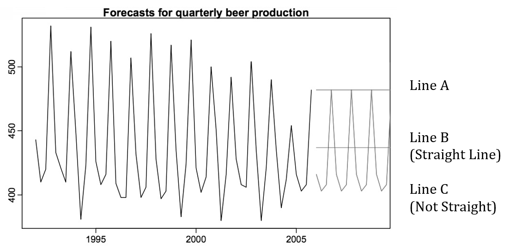
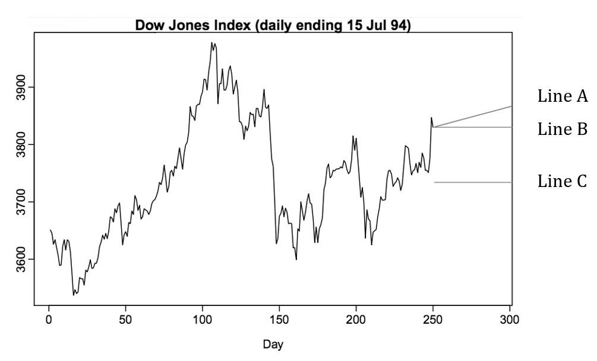
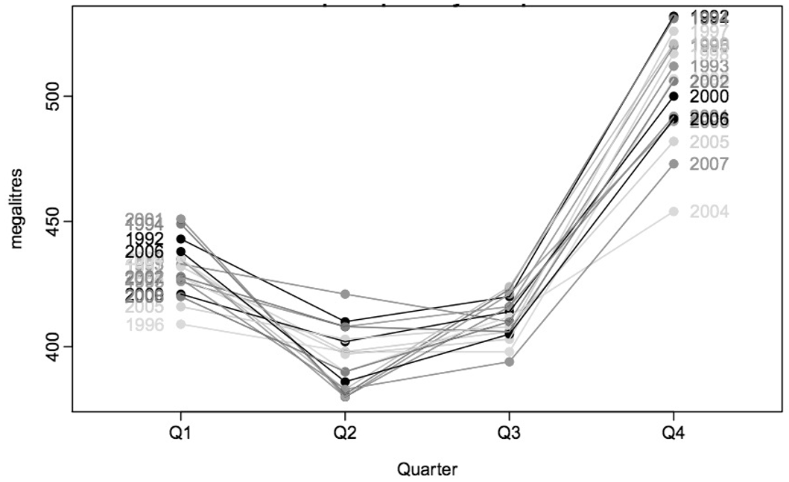
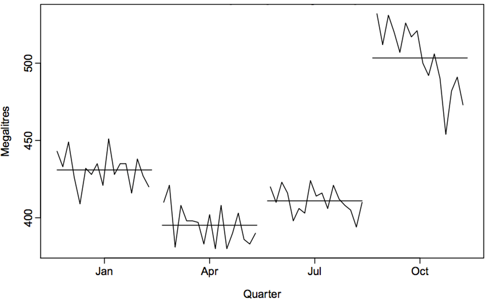

Submit your answers as a single pdf attach all R code. Failure to do so will result in grade reduction.

The exam must be done individually, with no discussion or help with others. Breaking this rule will result in an automatic 0 grade.


```{r setup, include=FALSE,warning=FALSE}
knitr::opts_chunk$set(echo = TRUE)

```


```{r}
library(tibble)
library(dplyr)
library(tidyr)
library(readr)
library(lubridate)
library(ggplot2)
library(tsibble)
library(fable)
library(fabletools)
library(feasts)
library(tsibbledata)
library(cowplot)
library(arules)
library(arulesViz)
```


# Part A (30 points) - each question worth 1 points

Some questions have multiple answers
1.	Which simple forecasting method says the forecast is equal to the mean of the historical data?
a.	Average Method
b.	Naïve Method
c.	Seasonal Naïve Method
d.	Drift Method
**Answer: **Average Method

2.	Which simple forecasting method says the forecast is equal to the last observed value?
a.	Average Method
b.	Naïve Method
c.	Seasonal Naïve Method
d.	Drift Method
**Answer: **Naïve Method

3.	Which simple forecasting method is equivalent to extrapolating a line draw between the first and lost observations?
a.	Average Method
b.	Naïve Method
c.	Seasonal Naïve Method
d.	Drift Method
**Answer: **Drift Method

4.	Which of the following is an assumption made about forecasting residuals during point forecast?
a.	Residuals are normally distributed
b.	Residuals are uncorrelated
c.	Residuals have constant variance
d.	None of the above
**Answer: **Residuals are uncorrelated

5.	Which of the following is an assumption made about forecasting residuals during interval forecasting? (multiple answers)
a.	Residuals have mean zero
b.	Residuals are normally distributed
c.	Residuals have constant variance
d.	None of the above
**Answer: ** all should present for full score
Residuals have mean zero, Residuals are normally distributed, Residuals have constant variance

6.	What is the consequence of forecasting residuals that are not uncorrelated?
a.	Prediction intervals are difficult to calculate
b.	Information is left in the residuals that should be used
c.	Forecasts are biased
d.	None of the above
**Answer: **Information is left in the residuals that should be used

7.	What is the consequence of forecasting residuals that don’t have mean zero?
a.	Prediction intervals are difficult to calculate
b.	Information is left in the residuals that should be used
c.	Forecasts are biased
d.	None of the above
**Answer: **Forecasts are biased

8.	Which measure of forecast accuracy is scale independent?
a.	MAE
b.	MSE
c.	RMSE
d.	MAPE
**Answer: **MAPE

9.	Calculation of forecasts is based on what?
a.	Test set
b.	Training set
c.	Both
d.	Neither
**Answer: **Training set

10.	Forecast accuracy is based on what?
a.	Test set
b.	Training set
c.	Both
d.	Neither
**Answer: **Test set

11.	A series that is influenced by seasonal factors is known as what?
a.	Trend
b.	Seasonal
c.	Cyclical
d.	White Noise
**Answer: **Seasonal

12.	Data that exhibits rises and falls that are not of a fixed period is known as what?
a.	Trend
b.	Seasonal
c.	Cyclical
d.	White Noise
**Answer: ** either or all is ok for full credit
Cyclical

13.	Data that is uncorrelated over time is known as what?
a.	Trend
b.	Seasonal
c.	Cyclical
d.	White Noise
**Answer: **White Noise

14.	Which of the following time series decomposition models is appropriate when the magnitude of the seasonal fluctuations are not proportional to the level?
a.	Additive
b.	Multiplicative
c.	Both
d.	Neither
**Answer: **Additive

15.	Which of the following time series decomposition models is appropriate when the magnitude of the seasonal fluctuations are proportional to the level?
a.	Additive
b.	Multiplicative
c.	Both
d.	Neither
**Answer: **Multiplicative 

Exhibit 1

16.	Refer to Exhibit 1. Line A is which simple forecasting method?
a.	Average Method
b.	Naïve Method
c.	Seasonal Naïve Method
d.	Drift 
**Answer: **Naive Method

17.	Refer to Exhibit 1. Line B is which simple forecasting method?
a.	Average Method
b.	Naïve Method
c.	Seasonal Naïve Method
d.	Drift Method
**Answer: **Average Method

18.	Refer to Exhibit 1. Line C is which simple forecasting method?
a.	Average Method
b.	Naïve Method
c.	Seasonal Naïve Method
d.	Drift Method
**Answer: **Seasonal Naive Method

Exhibit 2

19.	Refer to Exhibit 2. Line A is which simple forecasting method?
a.	Average Method
b.	Naïve Method
c.	Seasonal Naïve Method
d.	Drift Method
**Answer: **Drift Method

20.	Refer to Exhibit 2. Line B is which simple forecasting method?
a.	Average Method
b.	Naïve Method
c.	Seasonal Naïve Method
d.	Drift Method
**Answer: **Naive Method

21.	Refer to Exhibit 2. Line C is which simple forecasting method?
a.	Average Method
b.	Naïve Method
c.	Seasonal Naïve Method
d.	Drift Method
**Answer: **Average Method

Exhibit 3

22.	Refer to Exhibit 3. The peaks are in which quarter?
a.	Quarter 1
b.	Quarter 2
c.	Quarter 3
d.	Quarter 4
**Answer: **Quarter 4

23.	Refer to Exhibit 3. The trough are in which quarter?
a.	Quarter 1
b.	Quarter 2
c.	Quarter 3
d.	Quarter 4
**Answer: ** there are few in Q3 but largly it is Q2
Quarter 2

Exhibit 4

24.	Refer to Exhibit 4. The peaks are in which quarter?
a.	Quarter 1
b.	Quarter 2
c.	Quarter 3
d.	Quarter 4
**Answer: **Quarter 4

25.	Refer to Exhibit 4. The trough are in which quarter?
a.	Quarter 1
b.	Quarter 2
c.	Quarter 3
d.	Quarter 4
**Answer: **Quarter 2

26.	Refer to Exhibit 4. In which quarter is there a decline in the seasonal affect?
a.	Quarter 1
b.	Quarter 2
c.	Quarter 3
d.	Quarter 4
**Answer: **Quarter 4

Figure 5

| Year 1 |    |    |    | Year 2 |    |    |    |
|--------|----|----|----|--------|----|----|----|
| Q1     | Q2 | Q3 | Q4 | Q1     | Q2 | Q3 | Q4 |
| 10     | 6  | 8  | 12 | 11     | 7  | 9  | 13 |
27.	Refer to Figure 5. Using the average method, what is the forecast of Quarter 2 of Year 3? (Don’t use a calculator.)
a.	7
b.	9.5
c.	13.85
d.	13
**Answer: **9.5

28.	Refer to Figure 5. Using the naïve method, what is the forecast of Quarter 2 of Year 3? (Don’t use a calculator.)
a.	7
b.	9.5
c.	13.85
d.	13
**Answer: **13

29.	Refer to Figure 5. Using the seasonal naïve method, what is the forecast of Quarter 2 of Year 3? (Don’t use a calculator.)
a.	7
b.	9.5
c.	13.85
d.	13
**Answer: **7

30.	Refer to Figure 5. Using the drift method, what is the forecast of Quarter 2 of Year 3? (Don’t use a calculator.)
a.	7
b.	9.5
c.	13.85
d.	13
**Answer: **13.85

# Part B (30 points)
Choose a series from us_employment.cvs, the total employment in leisure and hospitality industry in the United States (see, title column).
```{r}
df = read.csv("us_employment.cvs")
df <- df %>% filter(Title == 'Leisure and Hospitality')
df %>% mutate(Month=yearmonth(Month)) %>% tsibble(index=Month) -> df
df_emp <- select(df,Month,Employed)
```
a. Produce an STL decomposition of the data and describe the trend and seasonality. (4 points)
```{r}
df_emp %>% model(STL(Employed)) %>% components() %>% autoplot()
```
b. Do the data need transforming? If so, find a suitable transformation.(4 points)
```{r}
qqnorm(df_emp$Employed)
qqline(df_emp$Employed, col = 14)
```
Yes, the data can be transformed, we will perform Box transform
```{r}
# BoxCox transformation
trans_emp_df <- df_emp %>% as_tsibble() %>% mutate(Employed = box_cox(Employed,df_emp %>% features(Employed, features = guerrero)))

# Checking with the qq plot
qqnorm(trans_emp_df$Employed)
qqline(trans_emp_df$Employed, col = 14)
```
c. Are the data stationary? If not, find an appropriate differencing which yields stationary data.(4 points)
```{r}
# KPSS test
trans_emp_df %>%
features(Employed, unitroot_kpss)
```
```{r}
# ndiffs to check the order for differencing
trans_emp_df %>% features(Employed, unitroot_nsdiffs)
```
The p-value of KPSS test is less than 0.05, hence data is not stationary. 
The order for differencing using ndiffs is 1.

d. Identify a couple of ARIMA models that might be useful in describing the time series. Which of your models is the best according to their AICc values?(5 points)
```{r}
gg_tsdisplay(trans_emp_df, difference((Employed), lag=12), plot_type='partial')
```
```{r}
set.seed(47)
# Fit the ARIMA models
fit_emp <- trans_emp_df %>%
  model(
    arima_auto_emp = ARIMA(log(Employed), stepwise = FALSE, approx = FALSE),
    arima1_emp = ARIMA(log(Employed)~0 + pdq(1,1,2) + PDQ(1,1,1))
  )
accuracy(fit_emp)
report(fit_emp[1])
report(fit_emp[2])
```
AICc of the auto arima model is -13278.11, it is lower than the manualli created Arima model. So, the auto arima model having (1,1,2)(2,1,1)[12] is the best.

e. Estimate the parameters of your best model and do diagnostic testing on the residuals. Do the residuals resemble white noise? If not, try to find another ARIMA model which fits better.(5 points)
```{r}
gg_tsresiduals(fit_emp %>% select(arima_auto_emp))
```

```{r}
augment(fit_emp) %>%  features(.innov, ljung_box, lag=24, dof=7)
```
Using the ACF plot we can tell that most lag lies within the boundary, only three of them crosss it. Hence, there is some white noise.
Our p value is also close to 0.0003888467	so our model has white noise.

f. Forecast the next 3 years of data. Get the latest figures from https://fred.stlouisfed.org/categories/11 to check the accuracy of your forecasts. (5 points)
```{r}
arima_auto_emp_fc <- fit_emp %>% forecast(h = "3 years")
arima_auto_emp_fc %>% autoplot(df_emp,level = 90) +labs(title="Forecast plot for US Employment", x = 'Date', y="Employed")
```
g. Eventually, the prediction intervals are so wide that the forecasts are not particularly useful. How many years of forecasts do you think are sufficiently accurate to be usable? (3 points)

```{r}
arima_auto_emp_fc <- fit_emp %>% forecast(h = "10 years")
arima_auto_emp_fc %>% autoplot(trans_emp_df,level = 90) +labs(title="Forecast plot for US Employment", x = 'Date', y="Employed")
```
We are able to approximately forecast the data for 5 years correctly.After that it is not reliable. 

# Part C (40 points)
##	Consider following transactions: (8 points)

1.	Eggs, Bread, Milk, Bananas, Onion, Yogurt
2.	Dill, Eggs, Bread, Bananas, Onion, Yogurt
3.	Apple, Eggs, Bread, Milk
4.	Corn, Bread, Milk, Teddy Bear, Yogurt
5.	Corn, Eggs, Ice Cream, Bread, Onion

## a)	Calculate by hand support, confidence and lift for following rules (without usage of apriory library, show your work) 

### •	{Bananas} -> {Yogurt}     (2 points)
```
N= 5
N_bananas = 2
N_yogurt = 3
N_bananas_yogurt = 2

support  = N_bananas/N= 0.4
confidence = N_bananas_yogurt/N_bananas = 1

support_yogurt =N_yogurt/N = 0.6

lift = confidence/support_yogurt = 1.67
```

### •	{Corn, Bread}->{Onion}     (3 points)
```
N= 5
N_corn = 2
N_bread = 5
N_onion = 3
N_bread_onion = 3
N_corn_bread_onion = 1

support  = N_corn_bread_onion/N = 0.2
confidence = N_corn_bread_onion/N_bread_onion = 0.33

support_onion = N_onion/N = 0.6

lift = confidence/support_onion = 0.55
```
### •	{Bread}->{Milk, Yogurt}     (3 points)
```
N= 5
N_bread = 5
N_milk = 3
N_yogurt = 3
N_milk_yogurt = 2
N_bread_milk_yougurt = 2

support  = N_bread_milk_yougurt/N = 0.4
confidence = N_bread_milk_yougurt/N_bread = 0.4

support_milk_yogurt = N_milk_yogurt/N = 0.4

lift = confidence/support_milk_yogurt = 1
```
# Part D (32 points)

Online_Retail2.csv contains transaction from online store in long format (i.e. single item per line and lines with same InvoiceNo is single transaction).
a)	Read data and convert it to transactions (hint: transactions function and format argument). (4 points)
```{r}

df = read.csv("Online_Retail2.csv")
df = df %>% select(-c(StockCode, InvoiceDate, CustomerID, Country))
trans_df <- transactions(df, format='long')
```
b)	Run summary on transactions. How many transactions are there? How many unique items? (4 points)
```{r}
summary(trans_df)
```
TOtal = 24446 transactions 
with  unique items = 4211.
c)	Inspect (with inspect) first three transactions. What items are in basket with transaction id 536366? (4 points)
```{r}
inspect(head(trans_df, n = 3))
df[df$InvoiceNo=="536366",]
```
HAND WARMER RED POLKA DOT and HAND WARMER UNION JACK.
d)	Visualize top 10 frequent items. What is the most frequent? (4 points)
```{r}

itemFrequencyPlot(trans_df,topN = 10)

ggplot(tibble(Support = sort(itemFrequency(trans_df, type = "absolute"), decreasing = TRUE),
    Item = seq_len(ncol(trans_df))
  ), aes(x = Item, y = Support)) + geom_line()


```
HANGING HEART T-LIGHT HOLDER is the most frequent
e)	We want to look at rule which would have at least 100 transactions. What support is corresponding to that? (4 points)
```{r}
100/nrow(trans_df)
```

```{r}

rule_retail = apriori(trans_df, parameter = list(support = 0.004090649, confidence = 0.9))
inspect(head(rule_retail, n=1))
```
**ANSWER**  0.00409 is the support value for 100 transaction . 

f)	Calculate rules with a rule. Use previously calculated support, confidence of 0.9 and maxlen of 4 (we are looking into the rules with up to 4 items). (4 points)
```{r}
cal_rules <- apriori(trans_df, parameter = list(supp=0.004090649, conf=0.9,maxlen=4))
summary(cal_rules)
```
Changing maxlen to 4 we get a total of 1216 rules.

g)	List top 10 by confidence. What is the sense of confidence (explain on example of the top rule)? (4 
points)
```{r}
inspect(head(cal_rules, n = 10, by = "confidence"))
```
CHRISTMAS TREE HEART DECORATION, SUKI SHOULDER BAG}	=>	{DOTCOM POSTAGE} is our the rule with confidence 1. 
From this we can tell that DOTCOM POSTAGE appear in transactions that contain CHRISTMAS TREE HEART DECORATION and SUKI  SHOULDER BAG quite often.
h)	List top 10 by lift. What is the sense of lift (explain on example of the top rule)? (4 points)
```{r}
inspect(head(cal_rules, n = 10, by = "lift"))
```
{DOLLY GIRL CHILDRENS CUP,                                                                                   
      SPACEBOY CHILDRENS BOWL,                                                                                    
      SPACEBOY CHILDRENS CUP}     => {DOLLY GIRL CHILDRENS BOWL} is the top rule. 
Lift is the measure of probability of how DOLLY GIRL CHILDRENS BOWL changes if DOLLY GIRL CHILDRENS CUP, SPACEBOY CHILDRENS BOWL and SPACEBOY CHILDRENS CUP are observed.


