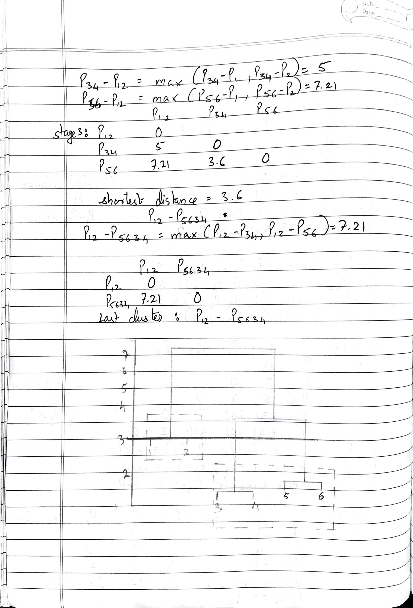
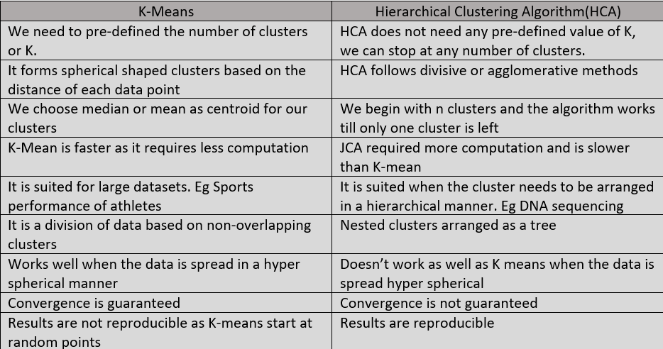

```{r setup, include=FALSE}
knitr::opts_chunk$set(echo = TRUE)


library(tibble)
library(dplyr)
library(magrittr)
library(ggplot2)
library(plotly)
library(data.table)
library(ggbiplot)
library(tidyr)
library(cowplot)
library(cluster)
library(GGally)
library(corrgram)
library(psych)
library(factoextra)
library(NbClust)
#Applying fix for fviz_nbclust functions
fviz_nbclust <- function (x, FUNcluster = NULL, method = c("silhouette", "wss", 
                                           "gap_stat"), diss = NULL, k.max = 10, nboot = 100, verbose = interactive(), 
          barfill = "steelblue", barcolor = "steelblue", linecolor = "steelblue", 
          print.summary = TRUE, ...) 
{
  set.seed(72)
  if (k.max < 2) 
    stop("k.max must bet > = 2")
  method = match.arg(method)
  if (!inherits(x, c("data.frame", "matrix")) & !("Best.nc" %in% 
                                                  names(x))) 
    stop("x should be an object of class matrix/data.frame or ", 
         "an object created by the function NbClust() [NbClust package].")
  if (inherits(x, "list") & "Best.nc" %in% names(x)) {
    best_nc <- x$Best.nc
    if (any(class(best_nc) == "numeric") ) 
      print(best_nc)
    else if (any(class(best_nc) == "matrix") )
      .viz_NbClust(x, print.summary, barfill, barcolor)
  }
  else if (is.null(FUNcluster)) 
    stop("The argument FUNcluster is required. ", "Possible values are kmeans, pam, hcut, clara, ...")
  else if (!is.function(FUNcluster)) {
    stop("The argument FUNcluster should be a function. ", 
         "Check if you're not overriding the specified function name somewhere.")
  }
  else if (method %in% c("silhouette", "wss")) {
    if (is.data.frame(x)) 
      x <- as.matrix(x)
    if (is.null(diss)) 
      diss <- stats::dist(x)
    v <- rep(0, k.max)
    if (method == "silhouette") {
      for (i in 2:k.max) {
        clust <- FUNcluster(x, i, ...)
        v[i] <- .get_ave_sil_width(diss, clust$cluster)
      }
    }
    else if (method == "wss") {
      for (i in 1:k.max) {
        clust <- FUNcluster(x, i, ...)
        v[i] <- .get_withinSS(diss, clust$cluster)
      }
    }
    df <- data.frame(clusters = as.factor(1:k.max), y = v, 
                     stringsAsFactors = TRUE)
    ylab <- "Total Within Sum of Square"
    if (method == "silhouette") 
      ylab <- "Average silhouette width"
    p <- ggpubr::ggline(df, x = "clusters", y = "y", group = 1, 
                        color = linecolor, ylab = ylab, xlab = "Number of clusters k", 
                        main = "Optimal number of clusters")
    if (method == "silhouette") 
      p <- p + geom_vline(xintercept = which.max(v), linetype = 2, 
                          color = linecolor)
    return(p)
  }
  else if (method == "gap_stat") {
    extra_args <- list(...)
    gap_stat <- cluster::clusGap(x, FUNcluster, K.max = k.max, 
                                 B = nboot, verbose = verbose, ...)
    if (!is.null(extra_args$maxSE)) 
      maxSE <- extra_args$maxSE
    else maxSE <- list(method = "firstSEmax", SE.factor = 1)
    p <- fviz_gap_stat(gap_stat, linecolor = linecolor, 
                       maxSE = maxSE)
    return(p)
  }
}

.viz_NbClust <- function (x, print.summary = TRUE, barfill = "steelblue", 
          barcolor = "steelblue") 
{
  best_nc <- x$Best.nc
  if (any(class(best_nc) == "numeric") )
    print(best_nc)
  else if (any(class(best_nc) == "matrix") ) {
    best_nc <- as.data.frame(t(best_nc), stringsAsFactors = TRUE)
    best_nc$Number_clusters <- as.factor(best_nc$Number_clusters)
    if (print.summary) {
      ss <- summary(best_nc$Number_clusters)
      cat("Among all indices: \n===================\n")
      for (i in 1:length(ss)) {
        cat("*", ss[i], "proposed ", names(ss)[i], 
            "as the best number of clusters\n")
      }
      cat("\nConclusion\n=========================\n")
      cat("* According to the majority rule, the best number of clusters is ", 
          names(which.max(ss)), ".\n\n")
    }
    df <- data.frame(Number_clusters = names(ss), freq = ss, 
                     stringsAsFactors = TRUE)
    p <- ggpubr::ggbarplot(df, x = "Number_clusters", 
                           y = "freq", fill = barfill, color = barcolor) + 
      labs(x = "Number of clusters k", y = "Frequency among all indices", 
           title = paste0("Optimal number of clusters - k = ", 
                          names(which.max(ss))))
    return(p)
  }
}
# assign them to the factoextra namespace
environment(fviz_nbclust) <- asNamespace("factoextra")
assignInNamespace("fviz_nbclust",fviz_nbclust,"factoextra")
environment(.viz_NbClust) <- asNamespace("factoextra")
assignInNamespace(".viz_NbClust",.viz_NbClust,"factoextra")


```

This is an exam. You cannot discuss it with anybody. You should do the work yourself. 
Questions 1, 2 and 3 can be done with pen and paper. If you choose so, you can 
submit the scans along with other material (you also can embed them to your knitted pdf).

The submitted files must include pdf-s with your answers along with all R scripts. For example:

 * Student A submitted:
   * Exam_1.pdf - final report containing all answers 
   * Exam_1.Rmd - R-markdown files with student solutions
 * Student B submitted:
   * Exam_1_Q1_Q2.pdf - scanned paper answers to questions 1 and 2
   * Exam_1_Q3_Q4.pdf - answers to questions 3 and 4
   * Exam_1.Rmd - R-markdown files with student solutions

No pdf report - no grade. If you experience difficulties with knitting, combine 
your answers in Word and any other editor and produce pdf-file for grading.

No R scripts - 50 % reduction in grade if relative code present in pdf- report, 
100% reduction if no such code present.

Late submissions will result in a points reduction: 10% first hour, 50% second hour, 
100% six hours. Only valid and documented reason to miss the exam or be late is acceptable. 
Sleeping in, lack of preparation, ennui, grogginess, inability to knit, etc. are not 
acceptable excuses. University policy allows multiple midterm exams on same day.

Reports longer than 25 pages are not going to be graded.

Exam must be submitted through UBLearns by 11:59pm 2022 October 14th.

# Question 1. Clustering with Pen and Paper (25 Points).

Consider following 6 points:
```{r echo=FALSE}
df <- tribble(
  ~x, ~y,
  1, 1,
  4, 1,
  3, 4,
  4, 5,
  3, 7,
  5, 7
)
t(df) %>% knitr::kable(col.names = 1:6)
```
**Q1.1** Perform single K-Means clustering with **Manhattan distance** using pen and paper.
Show you work in readable manner. (20 points)

You can use rmarkdown instead of paper, simple calculator or simple vector calculations in R.

> You can set points as p1 <- c(1,1), p2 <- c(4,1) and use regular math operation on them (+-*/).
> You also can use math function like sum, abs and so on and output function
> like print and cat
>

You will need a random sample without replacement, either of size two or six, 
use one generated below:
```{r echo=FALSE}
set.seed(72)
sample(1:6,6,replace = FALSE) %>% t() %>% knitr::kable(col.names = NA)
```

```
hint:
If you used pen and paper you can take a photo of it and add to Rmd using 
following markdown command:

```


**Q1.2** One of the students decided to check himself and make following clustering with R (5 points):

```{r echo=FALSE}
df <- tribble(
  ~x, ~y,
  1, 1,
  4, 1,
  3, 4,
  4, 5,
  3, 7,
  5, 7
)
set.seed(1)
clus <- kmeans(df,2)
# cluster1: 1,2
# cluster2: 3,4,5
```

That is the student got that first two points belong to first cluster and 
4 other points to second cluster. But the students results in Q1.1 are 
different. Can you explain why?

> hits: in general there are two reasons besides that student mess-up in Q1.1.
> assume that student is correct in Q1.1. Out of thouse two reasons only
> one actually have effect in this small example. Though if it is done not
> properly can play too.


```{r}
clus$cluster
print(clus$centers)
```

The centroids for the kmeans algorithm are different from the theoretical centers as we can see above. Our centroids we mean of the first half of the values and the second half. They were (2.6,2) & (4,6.3).
The centroids for the above kmeans used with seed value 1 are (2.50,1) & (3.75,5.75). I believe that it might differ due to two reasons:
1. The algorithm to find the centroids for R are better or more mordern as the ones we used in our theoretical approach. 
2. The seed values might affect the centroid algorithm.

# Question 2 (25 Points)

**Q2.1** Just like in Q.1.1 but this time perform hierarchical clustering with
complete linkage on same data. (20 points)

> After building whole tree, don't forget to cut it to get two clusters.
> Draw dendogram by hand (show proper hights) or using ascii graphics





**Q2.1** Do you expect hclust provides same answer as yours? Check it. (5 points)


```{r}
x <- c(1,4,3,4,3,5)
y <- c(1,1,4,5,7,7)
df_0 <- data.frame(x,y)
#df_0_sc <- as.data.frame(scale(df_0))
edist_mat <- dist(df_0, method = 'euclidean')
hclust_com <- hclust(edist_mat, method = 'complete')
plot(hclust_com)
rect.hclust(hclust_com , k = 3, border = 2:6)
abline(h = 3, col = 'red')
```

The above plot matches our manual plot so we can tell that hclust gives the same answer as our manual calculated plot.


# Question 3 (10 points)

Compare and contrast k-means and hierarchical clustering in terms of input, output,
speed, cluster characteristics/ability to separate manifold structures.




# Question 4 (40 points)
Clustering is often used to reexamine existing classifications. 
Sometime misclassification can occur in the original design. 
For example, one class might consist of two sufficiently 
different groups, or two classes are essentially the same.

In this exercise, you are presented with a seed dataset containing measurements 
from multiple wheat subspecies. Your task is to identify a number of subspecies.

`seeds.csv` constists of 200 records and reports 7 measurements for each seed:

* `length` - length of kernel
* `width` - width of kernel
* `asymmetry` - asymmetry coefficient
* `groove` - length of kernel groove
* `area` - area A
* `perimeter` - perimeter P
* `compactness` - compactness C = 4*pi*A/P^2

**Q4.1** Read and Visualize Dataset (5 points)
```{r}
# read dataset
df = fread("seeds.csv",stringsAsFactors = FALSE)
print(c("na values:",sum(is.na(df))))
print(c("null values:",sum(is.null(df))))

head(df)
summary(df)
```


```{r fig.width=8, fig.height=8}
# Examine dataset, for example by plotting it with GGally:ggpairs
data<-dplyr::select(df,length,width,asymmetry,groove,area,perimeter,compactness)
ggpairs(data)
```
Comment on observation, any distinct clustering?

The data which forms hyper spherical clusters are good for K-mean clustering, so from the above we can tell that the following are good for K Mean clustering:
-length-asymmetry:3 clusters visible
-width-asymmetry:3 clusters visible
-asymmetry-groove:2 clusters visible
-asymmetry-area:2 clusters visible
-asymmetry-perimeter:2 clusters visible
-asymmetry-compactness:2 clusters visible


**Q4.2** Run PCA (8 Points)

**Q4.2.1** Run PCA (don't forget to scaled data), 
save as `pc_out`, we will use `pc_out$x[,1]` and `pc_out$x[,2]` later for plotting

```{r}
df_scale <- as.data.frame(scale(df))
df_scale
pc_out <- prcomp(df_scale)
pc_out

```


**Q4.2.2** Make scree plot/percentage variance explained plot.
Comment on percentage variance explained 
(will two first components cover enough varience in dataset)

```{r}
#screeplot(pc_out, type = "line", main = "Scree plot")
exp_var = 100 * pc_out$sdev^2 / sum(pc_out$sdev^2)
print(exp_var)
# Scree plot
plot(exp_var, xlab = "Principal Components",
    ylab = "Explained variance",
     type = "b")
```
Percent variance explained as a cumulative sum of PC1 & PC2 is more than 80% which is enough for our analysis.


**Q4.2.3** Make biplot. Comment on biplots (clusters?, possible meaning of PC?)

```{r}
ggplotly(ggbiplot(pc_out,scale=1))
```
We can observe that the PC1 explaince 72% variance and PC2 explains 16.9% variance which sums up to give us more than 80% variance explained. Further I can see that there are 3 clusters, one from "compactness", one from "asymmetry" abd third from all the other components.


**Q4.3** Perform Clustering of your choise. Select number of clusters. (20 points)

looks like k-means should do the job, biplot has nice packed shape.


```{r}
#elbow method
#compute from k=2 to k=20
#k.max <- 20
#data <- df_scale
#wss <- sapply(1:k.max, 
#              function(k){kmeans(data, k, nstart=50,iter.max = 20 )$tot.withinss})
#wss
#plot(1:k.max, wss,
#     type="b", pch = 19, frame = FALSE, 
#     xlab="Number of clusters K",
#     ylab="Total within-clusters sum of squares")
fviz_nbclust(df_scale, kmeans, method = "wss") +
    geom_vline(xintercept = 4, linetype = 2)+
  labs(subtitle = "Elbow method")
```

```{r}
#Gap statistics
#gap_kmeans <- clusGap(df_scale, kmeans, nstart = 20, K.max = 10, B = 100)
#plot(gap_kmeans, main = "Gap Statistic: kmeans")
set.seed(72)
fviz_nbclust(df_scale, kmeans, nstart = 25,  method = "gap_stat", nboot = 50)+
  labs(subtitle = "Gap statistic method")
```

```{r}
#silhouette analysis
set.seed(72)
fviz_nbclust(df_scale, kmeans, method='silhouette')+
  labs(subtitle = "Silhouette method")

```
```{r}
library("NbClust")
nb <- NbClust(df_scale, distance = "euclidean", min.nc = 2,
        max.nc = 10, method = "kmeans")
fviz_nbclust(nb)

```
```{r}
km_3 <- kmeans(df_scale, 3, nstart = 25)
fviz_cluster(km_3, data = df_scale) + ggtitle("k=3")
```
From our analysis, we can tell that from elbow, gap analysis and Silhouette we are getting ideal values of k as 4,3,2 respectively. So from the above 3 itself we can tell that the ideal K should be 3 as it is the mean value(we have no majority here). I used further another library of 30 tests and found out that 13 tests resulted in K=3 with clear majority. Hence we shall used K=3 as ideal value.

**Q4.4** Characterize clusters. (5 points)
```{r}
df_scale$Cluster <- km_3$cluster
head(df_scale)
    
describeBy(df_scale, group="Cluster")
```
```{r}
char_data <- cbind(data, clusters= km_3$cluster) 
char_data$clusters <- as.factor(char_data$clusters)
plot_ly(char_data, y =~length ,color = ~clusters, type = "box" )  %>% layout(title = "Length in each cluster")
plot_ly(char_data, y =~width ,color = ~clusters, type = "box" )  %>% layout(title = "Width in each cluster")
plot_ly(char_data, y =~area ,color = ~clusters, type = "box" )  %>% layout(title = "Area in each cluster")
```

 
**Q4.5** How many subspecies you think are in the set? (does it matches conclussion from Q4.3?) (2 points)

From the above analysis data we can tell that there are 3 subspecies in the given dataset with major difference in the length and area. 
It matches our biplot analysis explectations in 4.3


